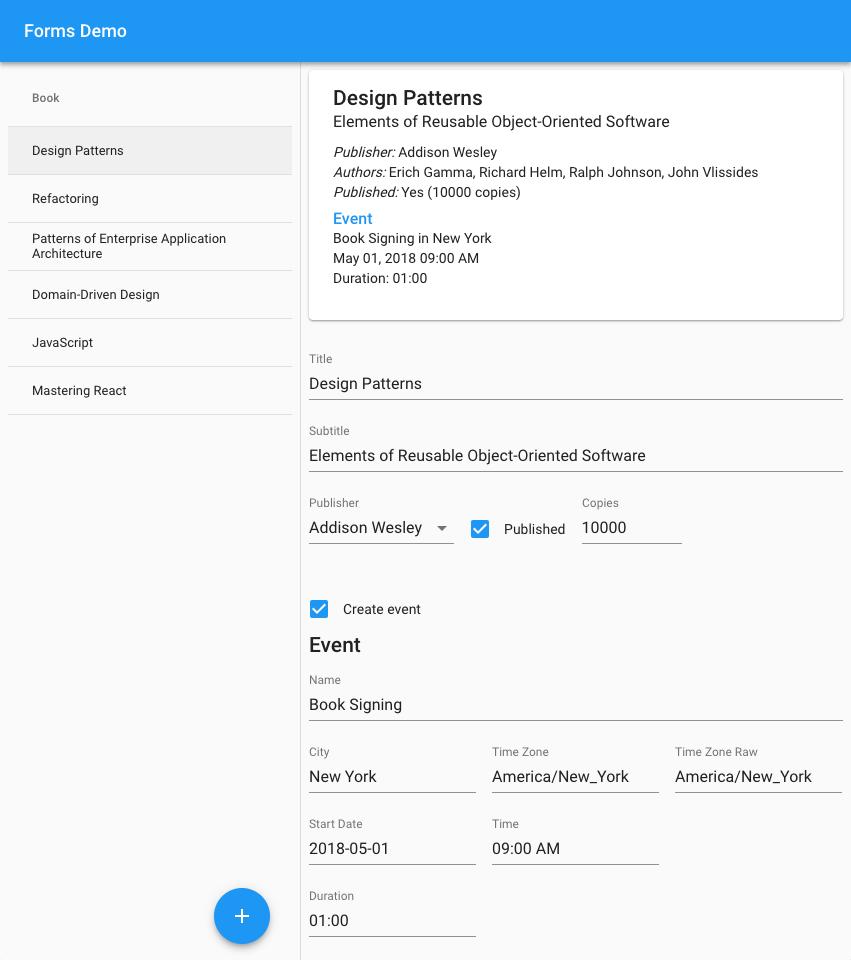

Form Libraries Demo
===================
This project demonstrates the use of form libraries for managing entity state and validation.

Getting Started
---------------
```bash
$ yarn
$ yarn start
```

Now point your browser to http://localhost:3000/.

Screenshot
----------

